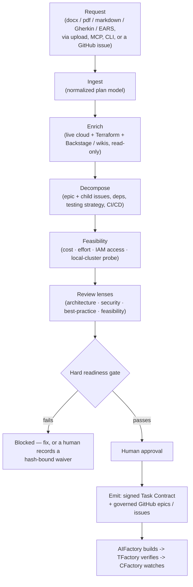

<p align="center">
  
</p>

# PFactory — Plan Factory

**The planning and governance node that sits in *front* of the AI execution
agents.** The first stage of the Factory line, alongside
[AIFactory](https://github.com/olafkfreund/AIFactory) (builds) and
TFactory (verifies): **PFactory plans and governs the work.**

Hand PFactory a request — uploaded as docx / pdf / markdown, or via the MCP
control plane, a CLI, or a GitHub issue/discussion. PFactory:

1. **Ingests** it into a normalized model (markdown / Gherkin / EARS / pdf / docx).
2. **Enriches** it with *live* organizational context — internal wikis and
   **Backstage** (catalog, TechDocs, golden-path templates), plus *read-only*
   introspection of running **Kubernetes / OpenShift / Azure / AWS / GCP**
   (load, quotas, policies, resources), **Terraform**, and cloud best-practice
   MCP servers.
3. **Decomposes** it into an epic and child issues; for software targets it adds a
   task breakdown, a testing strategy, and a generated CI/CD definition.
4. **Assesses feasibility** before any code — coarse cost, a calibrated effort
   rollup, IAM access (grant/deny per action), and a read-only local-cluster
   build/run probe.
5. **Reviews** it through architecture / security / best-practices / feasibility
   gates (hybrid deterministic policy-as-code plus LLM lenses) against pluggable
   templates that carry rules, then a **hard readiness gate** and a single
   **human approval**.
6. **Emits** a **signed Task Contract** plus governed, tagged **GitHub epics and
   child issues** — the durable source of truth that **AIFactory builds** and
   **TFactory verifies**, threaded by a shared correlation key.

Everything is pluggable: add MCP servers, skills, agents, and Backstage-compatible
templates via a declarative registry. Templates stay current — PFactory watches
the clouds and proposes updates via pull request.

> Status: **v0.6.x — a governed node in the Factory line.** The planning pipeline
> is live: ingest, live-infra enrichment, decomposition, feasibility (cost / effort
> / access / local-cluster probe), the review lenses, the hard readiness gate,
> human approval, and signed-contract emission. See
> [Market positioning](docs/market-positioning.md) and
> [Planning and trust](docs/planning-and-trust.md).

## The planning pipeline



The plan is the reviewed artifact: every gate is named and inspectable, waivers and
the approval are bound to the plan's content hash, and the emitted contract is HMAC
signed — so the work that ships is provably the work that was approved.

## The hard readiness gate

A plan cannot be emitted until these checks pass (or a human records a waiver bound
to the plan hash):

| Check | Hard | Waivable | What it blocks |
|---|---|---|---|
| `children-present` | yes | no | The epic produced no work units. |
| `criteria-present` | yes | yes | No explicit acceptance criteria. |
| `ac-child-coverage` | yes | yes | A criterion maps to no child issue. |
| `deps-sound` | yes | cycles: no | Dependency cycles or dangling edges. |
| `access-granted` | yes | yes | A required IAM action is denied. |
| `env-buildable` | yes | yes | The target environment can't build/run the work (read-only local-cluster probe). |
| `enrichment-integrity` | yes | yes | A live-infra adapter failed on a cloud-relevant plan. |
| `no-blocking-findings` | yes | **never** | A hardcoded secret or policy violation. |
| `decompose-trustworthy` | yes | yes | The decomposer silently fell back to a heuristic. |
| `ac-testable` / `access-verified` | no (advisory) | yes | Vague criteria; unverified access. |

## Quickstart (NixOS / flake-based)

```bash
nix develop                 # one-command dev environment
pfactory-minimal-venv       # apps/backend/.venv with pytest+pytest-asyncio
pfactory-test               # the non-SDK backend suite
bootstrap-venv              # full backend SDK install (graphiti, claude-agent-sdk, …)
```

The dev shell brings in Python 3.13, Node 22, uv, git, gh, just, ripgrep, jq and
docker-client, plus `bootstrap-venv`, `pfactory-minimal-venv`, `pfactory-test`,
`verify-fork`. For `direnv`: `nix profile install nixpkgs#nix-direnv && direnv allow`.

> **Non-Nix npm users:** the nix devShell sets `NODE_ENV=production`, so
> `npm install` skips devDependencies (incl. vitest). Inside `nix develop`,
> `unset NODE_ENV` first.

## Running the portal

```bash
# Backend (FastAPI on :3114)
cd apps/web-server && python -m server.main

# Frontend (Vite dev server on :3115)
cd apps/frontend-web && npm install && npm run dev
```

Then visit **http://localhost:3115** for the PFactory Planning Portal. The board
moves a plan through **Plans ready → Human Review → Done**: ingest a plan, watch it
process, review the cited gate scores and the readiness report, approve, and emit.

## Run on any LLM

PFactory routes each phase to a provider purely from the model string — no separate
provider switch. Supported: the Claude Agent SDK (primary), OpenAI Codex, Gemini
CLI (Antigravity), GitHub Copilot CLI, Ollama (local), and any OpenAI-compatible
endpoint (vLLM / LM Studio / OpenRouter / Together / Groq / LocalAI). The PARR line
has run end-to-end on Gemini. An honest data-egress badge
(`python apps/backend/byo_llm.py <model>`) tells you whether a run keeps data on
your network. See [`guides/byo-llm.md`](guides/byo-llm.md).

## Connect to your environment — Credential Broker

Planning and feasibility need to reach real services (a staging API, a Kubernetes
cluster, a cloud project) read-only — but secrets must never land in the repo. The
Credential Broker resolves credentials from a pluggable backend and exposes them
ephemerally:

- **Backends:** Azure Key Vault, AWS Secrets Manager, GCP Secret Manager,
  HashiCorp Vault, local sops / age / agenix, or plain env. One ref syntax
  (`vault:path#field`, `gcp-sm://proj/secret`, `sops:file#key`, …); cloud SDKs load
  lazily so an absent package never breaks startup.
- **Ephemeral and redacted:** file credentials (kubeconfig, GCP ADC) are written
  `0600` to a per-task scratch dir and wiped when the task ends; resolved values
  are redacted from logs.
- **Honest egress:** off by default — no cloud credential is resolved unless the
  project opts in. `python -m pfactory_secrets.cli audit` prints a secret-free
  manifest of exactly what would leave your network.

## Tests

```bash
# Backend
PYTHONPATH=apps/backend apps/backend/.venv/bin/pytest -q tests/

# Frontend (under nix devShell, unset NODE_ENV first)
cd apps/frontend-web && ../../node_modules/.bin/vitest run

# Fork-hygiene check (every stray AIFactory reference is allowlisted explicitly)
scripts/verify-fork.sh --no-import
```

## Docs

Full documentation: **https://pfactory.freundcloud.com/**

- [Architecture](https://pfactory.freundcloud.com/architecture/) — the planning pipeline, modules, dataflow
- [Planning and trust](https://pfactory.freundcloud.com/planning-and-trust/) — how PFactory plans and why you can trust it
- [Market positioning](https://pfactory.freundcloud.com/market-positioning/) — how we differ, the PARR-line value, why it's better
- [Roadmap](https://pfactory.freundcloud.com/roadmap/) — what's shipped and what's next

In-repo guides (`guides/`): `byo-llm.md` (run on your own infrastructure),
`spec-sources.md` (ingest markdown / Gherkin / EARS), `credentials.md` (the
Credential Broker), and the handover/MCP guides.

## Project tracking

- **Epic and sub-issues:** https://github.com/olafkfreund/PFactory/issues
- **Discussions / questions:** open an issue with the `question` label

## License

[MIT OR GPL-3.0](LICENSE).
