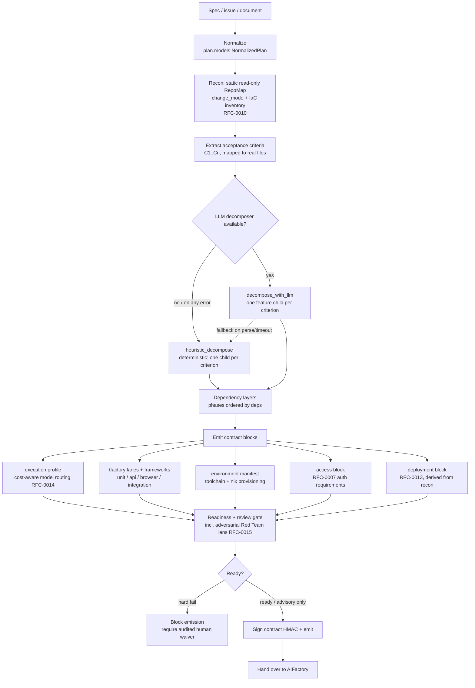
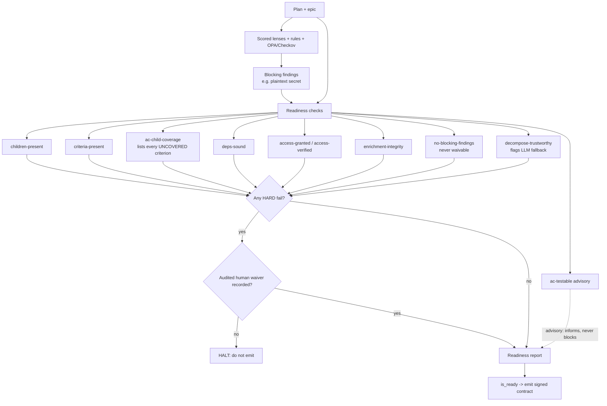

# How PFactory plans — and why you can trust the plan

This page is deliberately transparent. It explains exactly how PFactory turns a spec
into an execution and test plan, every choice it makes, and the checks it runs to prove
the plan is buildable and testable before any code is written. Nothing here is
aspirational — each step maps to a named module and a named gate you can inspect.

The short version: PFactory does not "decide by vibes." It decomposes deterministically,
maps every acceptance criterion to work, derives the test lanes and toolchain from the
plan, and then submits the plan to a **hard readiness gate** of explicit, named checks.
A plan that is missing information cannot be emitted just because it scored well on a
review — a blocking check has teeth, and overriding it requires a recorded, audited
human waiver.

## 1. The planning pipeline

What is deterministic vs model-driven (stated plainly):

- Acceptance-criteria extraction and the **one-child-per-criterion** decomposition are
  deterministic (`plan/decompose/planner.py: heuristic_decompose`).
- An LLM seam (`decompose_with_llm`) can produce a richer decomposition, but it **falls
  back to the deterministic heuristic on any prompt, parse, or timeout error** — and the
  `decompose-trustworthy` readiness check records when that fallback happened, so a
  degraded plan is visible, never silent.
- Lane selection, framework choice, the environment manifest, the access block, and the
  RFC-0013 deployment block are deterministic derivations from the plan and the recon
  RepoMap (`plan/emit/*`, `plan/recon/*`).
- The review gate runs the architecture / security / best-practice / feasibility lenses
  plus an adversarial **Red Team** lens (RFC-0015) that attacks the spec rather than
  confirming it; its findings surface alongside the others before the single human
  approval, not after the build. A per-project **constitution**, if declared, is injected
  into decomposition and hard-checked against the emitted plan.

## 2. How the test lanes and toolchain are chosen

Lane selection is a transparent, inspectable derivation in
`plan/emit/tfactory_block.py` — not a black box:

- `unit` is always present.
- `api` is added when the plan mentions an API surface (endpoint, REST, FastAPI,
  Express, GraphQL) or carries an api label.
- `browser` is added when the plan mentions a frontend/UI surface (frontend, React,
  Playwright, Vue, Svelte, Next, "browser").
- `integration` is added for docker/compose/database signals.
- The framework per lane follows the detected language (pytest for Python, jest for
  Node, playwright for browser).

The `environment` manifest (`plan/emit/environment_block.py`) is then derived from those
lanes: a browser lane adds `chromium` and a Playwright verify command and sets the
network posture; the toolchain language follows the unit framework. This manifest is the
single source of truth the build (AIFactory) and verify (TFactory) sides both turn into
the same `flake.nix` — see the hub guide "Reproducible test environments".

## 3. The trust gate — how we verify we have everything to code and test

Before a contract is emitted, the plan passes through two orthogonal layers
(`plan/review/gates.py`):

1. A **scored multi-lens review** (architecture, security, feasibility, testing, cicd;
   code lenses apply only to software plans) plus a **deterministic rules engine** and
   external policy (OPA / Checkov) for secrets, public exposure, missing resource
   limits, rollback, and feasibility (cost/effort/access).
2. A **hard readiness/completeness report** (`plan/review/readiness/checks.py`) that is
   independent of the review score. The critical property: *a high aggregate score
   cannot mask a missing-information blocker.*

Every check returns a structured, human-readable line: `check_id`, `title`, pass/fail,
`severity`, `detail`, `remediation`, and `evidence`. That is the transparency contract —
you can read precisely why a plan was or was not considered ready. Examples:

- `ac-child-coverage` does not just say "covered" — on failure it lists the exact
  acceptance-criteria IDs that no child addresses, so a gap is named, not hidden.
- `no-blocking-findings` is **never waivable**: a hardcoded secret or policy violation
  hard-stops emission, full stop.
- `decompose-trustworthy` records when the LLM decomposition fell back to the heuristic,
  so you know whether you are trusting the model or the deterministic path.
- `ac-testable` flags vague criteria (e.g. fewer than three words) as advisory — it warns
  but does not block, because measurability is a quality signal, not a correctness one.

A blocking fail is overridden only by a **waiver** (`plan/review/readiness/waiver.py`):
a deliberate, audited override bound to the plan's hash (so it cannot silently carry over
to an edited plan). The emitted contract is HMAC-signed, so AIFactory and TFactory can
verify it is the exact plan that passed the gate.

## 4. Why this is trustworthy (the honest version)

- **Everything is named and inspectable.** The decomposition rule, each lane heuristic,
  and each readiness check are small, named functions with reasons and remediation. There
  is no hidden scoring that decides "good enough" on its own — the hard gate is separate.
- **Coverage is explicit.** Every acceptance criterion is mapped to a child, and any
  uncovered criterion is reported by ID.
- **Failures have teeth.** Missing information or a blocking finding stops emission; an
  override is a recorded human decision, not a default.
- **Model use is bounded and visible.** The LLM only enriches a decomposition that has a
  deterministic fallback, and any fallback is surfaced.

Known limitations we do not paper over:

- Lane selection is keyword/heuristic-based; an unusual spec can under- or over-select a
  lane. The lanes are in the contract for you to inspect and adjust.
- `ac-testable` is advisory: a poorly-worded criterion can still pass the hard gate. The
  downstream AC-to-code fidelity is verified later by TFactory, not asserted here.
- The LLM decomposition, when used, is only as good as the spec; the gate catches missing
  coverage and blocking findings, not subtle misinterpretation. That is why TFactory
  independently verifies against the real built code.

## 4.5 Cost is a running figure, not a terminal one

A plan session runs a real LLM pipeline — detect, decompose, synthesize, and the
governance gates above — and most of that cost is spent *before* a human ever approves
anything. A plan can sit at `processed` awaiting approval, or be abandoned, and still
have cost real money to produce.

So PFactory reports cost as it accrues, not only on a terminal outcome. The moment a
session reaches `processed` (post-pipeline, awaiting approval), it emits a
**non-terminal usage snapshot** — `plan.completion.emit_usage_snapshot`, carried on the
same signed completion envelope as the terminal events, with the session's current
status and accrued token usage. CFactory records usage from any event that carries it,
so the cockpit shows the planning-and-gate cost of a plan regardless of whether it is
later approved, rejected, or simply left parked. This mirrors AIFactory's running-cost
emit on the build side, so the same plan's cost reads consistently across the fleet.

The honest line on figures: a money number only appears for **metered** billing modes
(API / managed cloud). On a subscription or a local model the snapshot reports tokens
and wall-clock, not a notional dollar amount — because inventing a price for a flat-rate
plan would be a worse answer than the truth.

## 5. What teams do

1. Write specs with clear, testable acceptance criteria (one measurable statement per
   line reads best; `ac-testable` will nudge you on vague ones).
2. Read the readiness report. If a hard check fails, fix the spec — do not reach for a
   waiver unless the override is a genuine, owned decision (it is audited).
3. For UI behaviour, describe it concretely (titles, headings, button actions) so the
   browser lane is selected and the environment manifest carries a browser toolchain.

See also: the fleet guide "Reproducible test environments" (how the manifest becomes a
Nix flake and runs in an ephemeral Job), and `RFC-0002` (the Task Contract).
